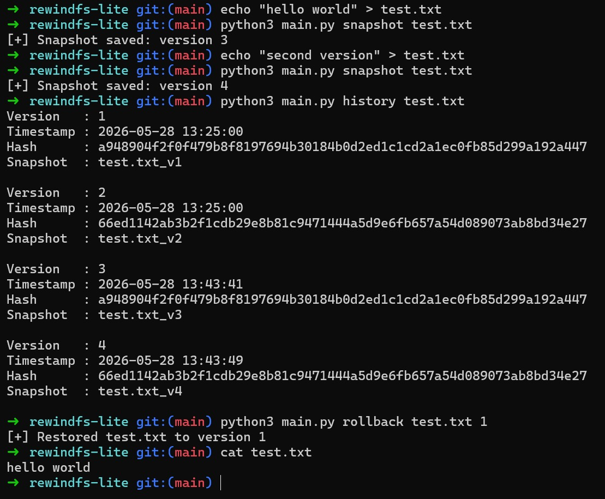

# rewindfs-lite

rewindfs-lite is a lightweight snapshot-based file versioning tool built to explore rollback systems, file history tracking, and simplified filesystem concepts.

The project takes inspiration from tools and systems such as Git, Time Machine, and snapshot-oriented filesystems, while keeping the implementation minimal and easy to understand.

## Features

* Snapshot creation for files
* File version history tracking
* Rollback and recovery support
* SHA-256 file hashing
* JSON-based metadata indexing
* Command-line interface

## Project Goals

This project was built to better understand:

* snapshot architecture
* rollback systems
* file versioning concepts
* metadata management
* hashing and integrity verification
* filesystem-inspired design

while implementing a small but functional systems-oriented tool.

## Tech Stack

* Python
* JSON
* File I/O
* hashlib
* shutil

## Repository Structure

```text
rewindfs-lite/
├── main.py
├── README.md
├── metadata.json
└── snapshots/
```

## Commands

Initialize the project:

```bash
python3 main.py init
```

Create a snapshot:

```bash
python3 main.py snapshot test.txt
```

View snapshot history:

```bash
python3 main.py history test.txt
```

Rollback to an older version:

```bash
python3 main.py rollback test.txt 1
```

## Example Workflow

```bash
echo "hello world" > test.txt

python3 main.py snapshot test.txt

echo "second version" > test.txt

python3 main.py snapshot test.txt

python3 main.py history test.txt

python3 main.py rollback test.txt 1
```

## How It Works

Snapshots are stored as versioned copies inside the `snapshots/` directory.

Metadata for each file is stored in `metadata.json`, including:

* version number
* timestamp
* SHA-256 hash
* snapshot filename

Rollback restores a selected snapshot back into the working file.

## Demo



## Future Improvements

* directory snapshots
* diff viewer
* automatic snapshots
* deduplication
* compressed snapshot storage
* ignore rules similar to `.gitignore`

## Status

Still experimenting with rollback and snapshot ideas.
